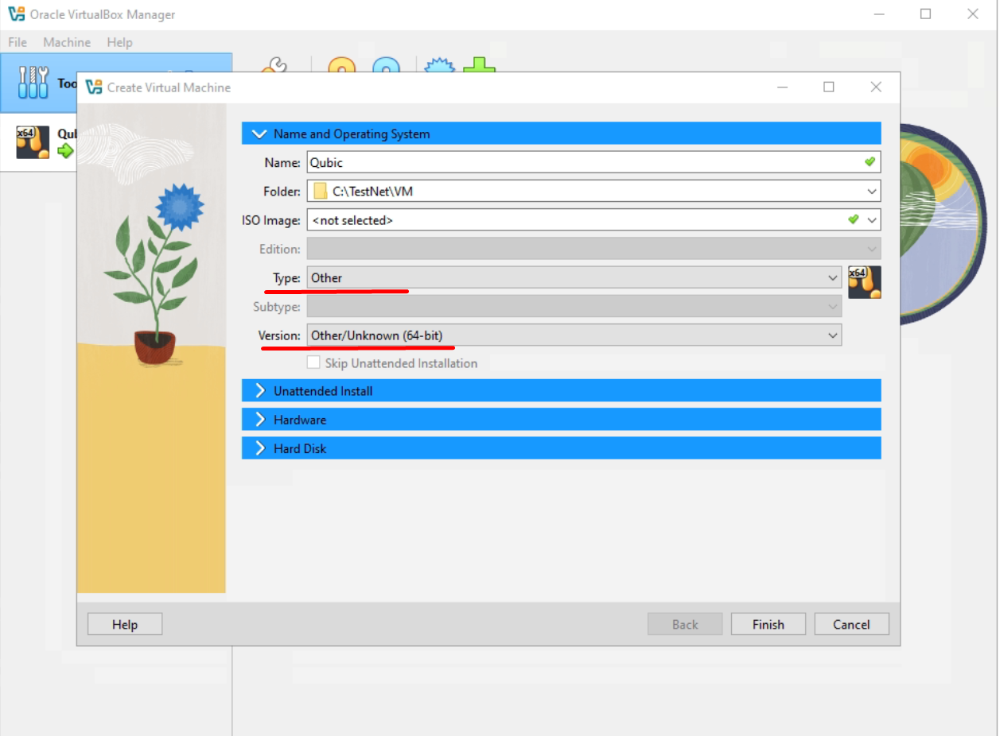
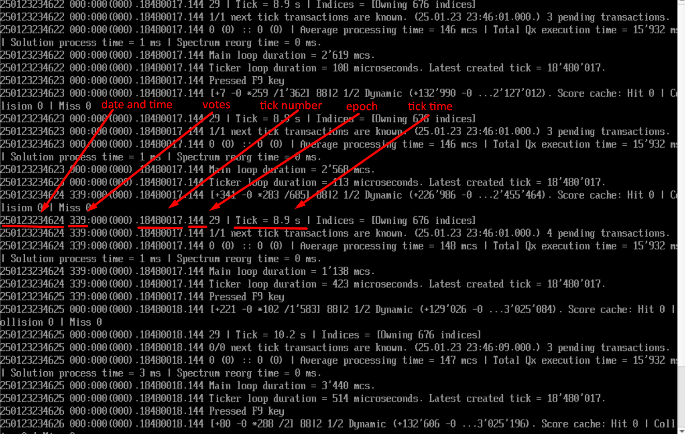

# Qubic Network Deployment Guide

This guide provides detailed instructions for creating and launching a Qubic test network using virtual machines.

## Minimum Requirements

To start the Qubic test network, you need one node with the specifications listed below and an additional machine to run the `echo.py` script.  
For a more stable and faster network, it is recommended to run the network on **two nodes**. In this case, the `echo.py` script is not required.

### Qubic Node Minimum Specifications:
1. A server or computer with at least **8 CPU cores** (high-frequency CPU with AVX2 support).
2. At least **64 GB of RAM**.
3. A **100 Mbps synchronous internet connection**.

**Pre-Setup:** Configure UTC Time on Your Machine

You can skip the steps for creating and configuring the VHD and download the pre-configured one from the link below. The archive contains a 32GB VHD.
> [GoogleDisk](https://drive.google.com/file/d/1N0GgWnWx-mx-euQUZGZ0M7WM1Rkd8olw/view?usp=drive_link)
---

## Table of Contents

1. [Quick Workflow Summary](#quick-workflow-summary)
2. [Creating and Preparing a VHD for a VM on Windows](#creating-and-preparing-a-vhd-for-a-vm-on-windows)
3. [Creating and Preparing a VHD for a VM on Linux](#creating-and-preparing-a-vhd-for-a-vm-on-linux)
4. [Installing and Configuring the VM](#installing-and-configuring-the-vm)
5. [Creating `qubic.efi`](#creating-qubicefi)
6. [Running the Network on a single node](#running-the-network-on-a-single-node)
7. [Sending Indices to the Node](#sending-indices-to-the-node)
8. [Additional Information](#additional-information)

---

## Quick Workflow Summary

Follow these steps to quickly set up and launch the Qubic test network:

1. **Compile the `qubic.efi` file**.
2. **Mount the VHD**.
3. **Delete system and score files** (if present).
4. **Replace the `qubic.efi` file** in the `efi/boot` directory.
5. **Unmount the VHD**.
6. **Launch the VM**.
7. Switch to **Main/Main mode**.
8. **Broadcast the list of computers**.

---

## Creating and Preparing a VHD for a VM on Windows

To create and prepare a Virtual Hard Disk (VHD) on Windows, follow these steps:

1. Open **Disk Management**, then go to **Action -> Create VHD**.  
    

2. Choose a location for the VHD file and set the disk size.  
   > **Note**: One epoch requires at least **3.2 GB**. If you plan to run the network for multiple epochs, ensure the VHD is sized accordingly.

3. Configure the VHD as shown in the screenshots below:  
      
     
    
    

4. Copy and extract the files from `144.zip` to the newly created disk. The disk should contain the following folders:
   - **efi folder**  
   - **contract files**
   - **spectrum**
   - **universe**
   
    

5. The VHD is now ready. **Detach** it (right-click on the disk and choose "Detach VHD") and proceed to the [Installation and Configuration of the VM](#installing-and-configuring-the-vm).  
    

---

## Creating and Preparing a VHD for a VM on Linux

To create and prepare a Virtual Hard Disk (VHD) on Linux, follow these steps:

1. **Install the required utilities**:  
   Install `qemu-utils` for working with VHD:  
   ```
   sudo apt-get install qemu-utils
   ```

2. **Create a raw disk image** of the desired size (e.g., 16 GB):
   ```
   dd if=/dev/zero of=/root/q.vhd bs=1M count=16384
   ```

3. **Convert the raw image to VHD format** using qemu-img:
   ```
   qemu-img convert -f raw -O vpc /root/q.vhd /root/qubic.vhd
   ```

4. **Create a directory for mounting** the VHD:
   ```
   mkdir /mnt/qubic
   ```

5. **Attach the VHD file** to a loop device using losetup:
   ```
   sudo losetup -f --show --partscan /root/qubic.vhd
   ```

After running the above command, you will receive a loop device name (e.g., /dev/loopX). **Replace loopX with your actual loop device number** in the following commands.
   

6. **Create an MS-DOS partition table**:
   ```
   sudo parted /dev/loopX mklabel msdos
   ```

7. **Create a primary partition**:
   ```
   sudo parted /dev/loopX mkpart primary fat32 0% 100%
   ```

8. **Format the partition as FAT32**:
   ```
   sudo mkfs.vfat /dev/loopXp1
   ```

9. **Mount the partition** to the directory created earlier:
   ```
   sudo mount /dev/loopXp1 /mnt/qubic
   ```
 
9. **Copy and extract the contents** of 144.zip to the mounted directory:
   ```
   cp 144.zip /mnt/qubic
   unzip /mnt/qubic/144.zip -d /mnt/qubic
   ```
 
9. **Ensure the extracted directory contains the following**:

   - efi folder
   - contract files
   - spectrum
   - universe
 
9. **Unmount the VHD** when the preparation is complete:
   ```
   sudo umount /mnt/qubic
   sudo losetup -d /dev/loopX
   ```

---

## Installing and Configuring the VM

1. **Download and install VirtualBox**  
   > Official link: [virtualbox.org](https://www.virtualbox.org/wiki/Downloads/) 
 
   Go to the VirtualBox official website, download and install VirtualBox for your operating system.  
    

2. **Download and install the Extension Pack**:
   - Open VirtualBox  
   - Press `Ctrl + T`.
   - Click **Add** (the "+" icon) and select the downloaded Extension Pack file to install it.  
    

3. **Create a New Virtual Machine**  
   - Click the **New** button in VirtualBox or press `Ctrl + N`.  
    

4. **Configure the VM**  
   Set the following options for the new virtual machine:
   - **Name**: Choose a name for your VM (e.g., "Qubic-TestNet").
   - **Type**: Other.
   - **Version**: Other/Unknown (64-bit).  
    

   - **Base Memory**: Allocate the maximum amount of RAM (e.g., **61440 MB** or more).
   - **Processors**: Allocate the maximum number of CPU cores.
   - **Enable EFI**: Check the box to enable EFI (ensure this option is enabled).  
    

   - **Virtual Hard Disk**: Select **Use an existing virtual hard disk file**, and attach the VHD file you prepared earlier.

5. **Open the settings for your VM**  
   - Select the VM and click **Settings**.
   - Go to the **Network** tab:
     - Enable **Adapter 1** and set it to **Paravirtualized Network**.  
    

6. **Configure port forwarding for external access** 
    

7. **Run the VM**
   After launching the node, check the output logs.  
   If the output matches the screenshot below, you can proceed to create your custom `qubic.efi` file.  
    

---

## Creating qubic.efi

1. **Clone the Qubic Core project or the specific branch** you need  
     
   > [https://github.com/qubic/core.git](https://github.com/qubic/core.git)

2. **Launch Visual Studio**  
   Open the cloned repository in Visual Studio.

3. **Modify the settings** for the test network
   
   To run the node on a test network, you need to make some modifications to reduce the required RAM and adjust other settings. Use all the changes from the following commit:  
   > [https://github.com/qubic/core/commit/eea402a7205e2ce217e65cd6c533fddf32c8823c](https://github.com/qubic/core/commit/eea402a7205e2ce217e65cd6c533fddf32c8823c)  

   This commit allows the network to run on nodes with 64 GB of RAM. It also reduces the space needed for indices and sets the epoch duration based on the number of ticks.

   **Update the port**  

   In `qubic.cpp`, change the port to the value you want (e.g., 31843):  
   ```
   #define PORT 31843
   ```

   **Modify the epoch duration**

   In public_settings.h, set the desired epoch duration (e.g., 1000 ticks):

   ```
   #define TESTNET_EPOCH_DURATION 1000
   ```

   **Change the epoch number and starting tick**

   Ensure the epoch number matches the one in your contract, universe, and spectrum files. If necessary, rename the files.
   In qubic.cpp, set:

   ```
   #define EPOCH 144
   #define TICK 18480000
   ```

   **Set the arbitrator**

   In qubic.cpp, set the arbitrator to your desired value:

   ```
   #define ARBITRATOR "GVNXISEPVVSOQADMESMUYXNXABBCYFNKGPSNSSILQBOULADLKGWGXAFBCHXH"
   ```

   **Update the operator ID** for remote node management

   In private_settings.h, set the operator ID. You can either choose an ID from the seeds file or use your own:

   ```
   #define OPERATOR "AAAAAAAAAAAAAAAAAAAAAAAAAAAAAAAAAAAAAAAAAAAAAAAAAAAAAAAAAAAA"
   ```

   **Replace computorSeeds** with seeds from the computorSeeds.txt file

   The computorSeeds.txt file contains 676 entries. To run the network on two or more nodes, compile a separate qubic.efi for each node.
   Split the seeds from the computorSeeds.txt file across the nodes. 
   For a single node, use all 676 entities (and refer to the instructions in [Running the Network on a Single Node](#running-the-network-on-a-single-node)).

   Update computorSeeds with the appropriate seed.

   ```
   static unsigned char computorSeeds[][55 + 1] = {
       "aaaaaaaaaaaaaaaaaaaaaaaaaaaaaaaaaaaaaaaaaaaaaaaaaaaaaaa",
   };
   ```
   **Add your node IPs**

   Replace the default IP in knownPublicPeers with your node IP(s) and the IP of the machine running the echo.py script (located in the doc folder):

   ```
   static const unsigned char knownPublicPeers[][4] = {
       {192, 168, 1, 101}, // IP of Node 1
       {192, 168, 1, 102}, // IP of Node 2 / IP of the machine with echo script
   };
   ```

5. **Compile the project**

In Visual Studio, select Release mode (do not use ReleaseAVX512, as it will not work on the VM).
Build the project to generate the qubic.efi file.

5. **Prepare the VHD**

   - Mount the VHD.
   - Delete the system and score files from the disk (this is necessary before every node restart).
   - Replace the efi/boot/qubic.efi file with the one you compiled.
   - Unmount the VHD.

6. **Launch the node**

After launching the node, check the output logs.
If the output matches the expected result (similar to the screenshot below), you can proceed to the next stage.
 

---

## Running the Network on a Single Node

To start the Qubic test network on a single node, you need an additional machine to run the echo.py script. If you are running the network on two or more nodes, you can skip this step.

Modify the echo.py Script
Open the echo.py script in a text editor and update the following line:

   ```
   server_address = ("193.135.9.63", 31843)
   ```

Replace "193.135.9.63" with the IP address of the machine where the script will run.
Replace 31843 with the port number specified in the qubic.cpp file.

Run the Echo Script

   ``` 
   python3 echo.py
   ```

Add the IP address of the machine running the echo.py script to the peers section in private_settings.h of the Qubic node:

   ```
   static const unsigned char knownPublicPeers[][4] = {
       {192, 168, 1, 101}, // IP of Node 1
       {192, 168, 1, 102}, // IP of the machine with echo script  
   };
   ```

---

## Sending Indices to the Node

1. **Switching to MAIN/MAIN Mode**  
   To allow the node to receive indices, you need to switch to **MAIN/MAIN Mode**.  
   This mode must be set on all nodes.

   - Press **F12** three times while the node is running.  
     Each press of **F12** cycles through the following modes:  
     - aux/aux  
     - Main/aux  
     - aux/Main  
     - **Main/Main**  
   
   - To verify the current mode, press **F2** to check the current status of the node.  
     Look for the active mode in the status output.  
     Ensure the node is set to **MAIN/MAIN mode**.  
    

2. **Sending Indices to the Node**  
   To send indices to the node, you need to broadcast the list of computers using the `broadcastComputorTestnet` program.  
   **Important**: Run this program on **only one node** at a time!

   Run the `broadcastComputorTestnet` command with the following syntax:  
   ```
   ./broadcastComputorTestnet <ip> <epoch> <port>
   ```
   - <ip>: The IP address of the node where you want to send the indices.
   - <epoch>: The epoch number (e.g., 144).
   - <port>: The port used by the node (e.g., 31843).

   Example command:

   ```
   ./broadcastComputorTestnet 193.135.9.63 144 31843
   ```

   Check the Command Result
   After running the command, check the output. If the command is executed successfully, you should see output similar to the following:
    

   The node should receive the indices and display them in the logs:
    

   Once the indices are received, the network should start ticking (the tick number will increase):
    

If the node is ticking, it means the network has been successfully started. To interact with the network, you can use the qubic-cli tool.
   > https://github.com/qubic/qubic-cli.git

   Example command to check the balance of an address:

   ```
   ./qubic-cli -nodeip 91.210.226.133 -nodeport 31841 -getbalance SCTZJZQQCULIIGFGDANGDBMMBWSBJEOGNYOCBRZJOAOZYAHMKHJDXBPBDFIH
   ```

3. **Troubleshooting**

If the node doesn't receive the indices on the first attempt, try running the command multiple times until the indices are successfully received.

If the network doesn't start ticking, follow these steps:

Check thread health: Press F2 while the node is running to display the current status of the node.
 
Ensure that all threads are healthy and the node is operating properly.

Check the node connection: Verify that the node is reachable at the specified IP and port.
Ensure that the network configuration is correct and there are no connectivity issues.

---

## Additional Information

All Smart Contracts (SC) and functions work the same as in the main network.

The file seeds+IDs(15blneach).txt contains seeds and their IDs with 15 billion QUs on each address.

If the network gets stuck (ticks are not changing, excluding the initial tick), press F9 to resend the votes.

If the epoch changes, broadcast the list of computers again using broadcastComputorTestnet with the updated epoch number.

If you have any questions or issues with launching the network, please contact me on Discord:
kavatak


